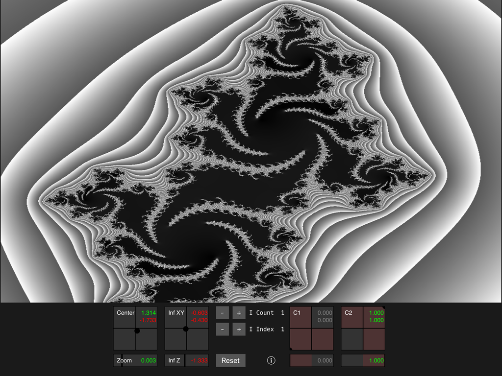

# Inflection
Transformed Julia Sets for IOS iPads

Please read the excellent exposition:
https://fractalforums.org/other/55/inflector-gadget-inflection-mapping-for-complex-quadratic-polynomials/519

The usual Julia set is transformed by inflecting it at various locations.

